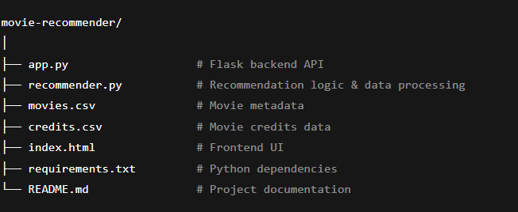

# 🎬 Movie Recommender API & Web App

A simple Flask-based movie recommendation system with a sleek frontend UI.  
It recommends movies based on a movie title or keywords/genres using content-based filtering with TF-IDF and cosine similarity.

---

## Features

- Recommend movies similar to a given **movie title**  
- Recommend movies based on **keywords or genres**  
- Clean, responsive web UI to enter queries and view recommendations  
- Backend API built with Flask, serving recommendation results in JSON  
- Handles errors and invalid inputs gracefully  
- Uses movie metadata (`movies.csv` and `credits.csv`) for recommendations  
- Easy to extend or modify recommendation logic  

---

## Demo Screenshot


---

## Getting Started

### Prerequisites

- Python 3.7 or higher  
- `pip` package manager  

---

### Installation

1. Clone the repository:

   ```bash
   git clone https://github.com/your-username/movie-recommender.git
   cd movie-recommender

### Project Structure


### Running the Application

1.Start the Flask backend server:
   ```bash 
   python app.py


